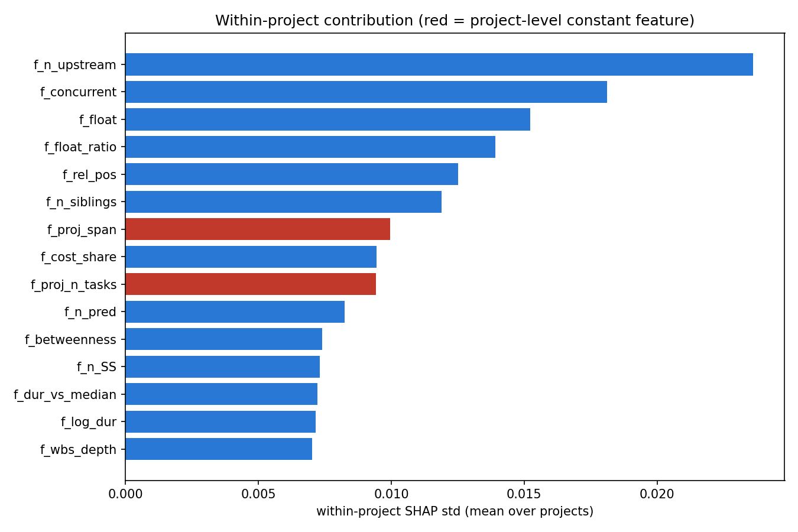
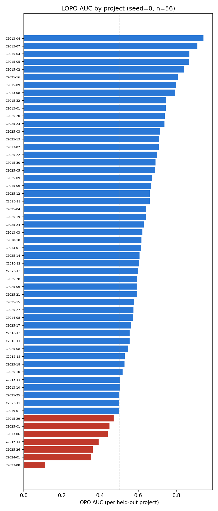
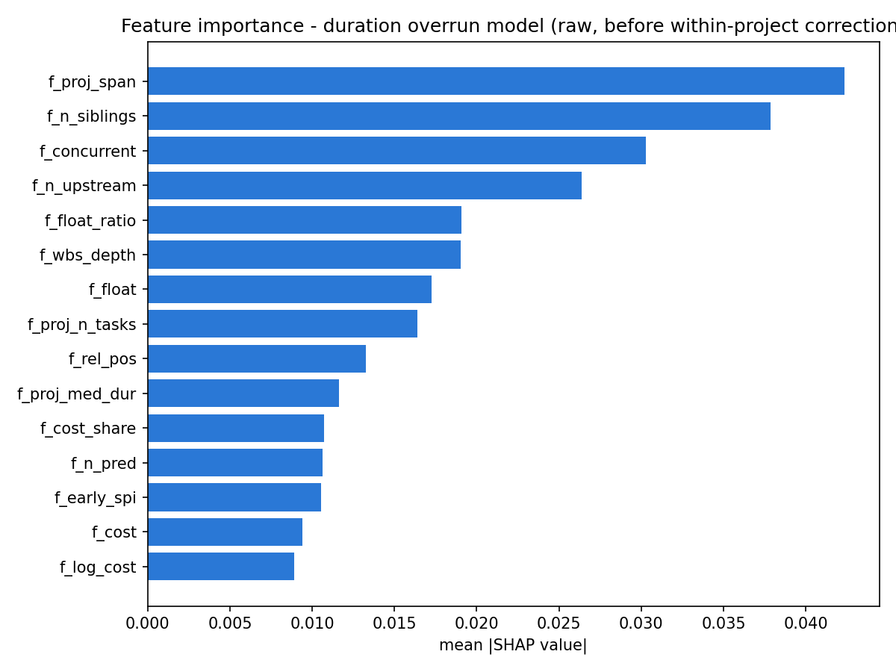
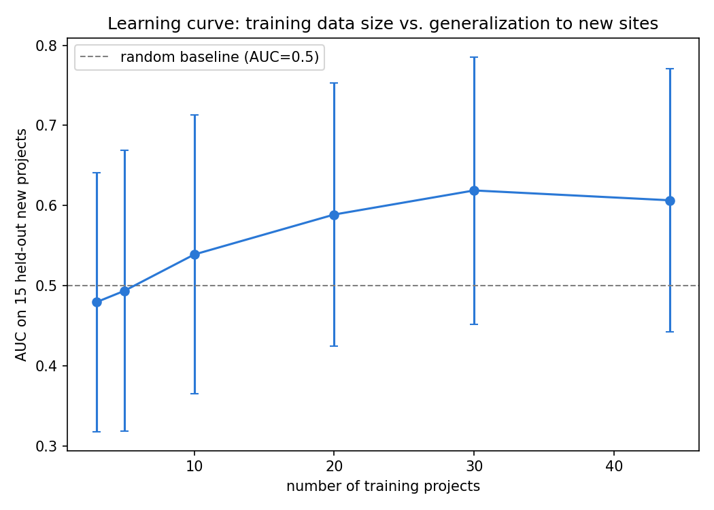

# 🏗️ 工程專案任務延遲風險預測

用機器學習在**任務還沒開始前**,排出「這個工地裡最該優先盯的高風險任務」——
而不是等傳統進度指標(如 SPI)落後之後,才發現已經來不及。

> 這是一個資料分析與機器學習應用專題,核心驗證框架(留一專案交叉驗證、
> 打亂標籤顯著性檢定、增量資訊價值檢驗)刻意類比銀行風控違約預測模型的驗證邏輯,
> 作為求職銀行/金融業資料分析職缺的作品集案例。

<p align="center">
  
  
</p>

<p align="center"><sub>左:修正後真正驅動同工地任務排序的特徵(方法論見下方「關鍵發現」)　|　右:56 個工地的留一專案驗證 AUC</sub></p>

---

## 📊 核心成效(留一專案交叉驗證,對「模型從未看過的工地」)

- **AUC 0.61**(隨機猜測基準 0.5),59 個工地輪流驗證,56 折有效
- **前 10 名高風險任務命中率 42%**,比隨機挑選(27.5%)高 **1.77 倍**
- **81% 的工地**上,模型排序表現優於隨機猜測

以上數字皆可用本 repo 內的腳本 + 已附上的真實特徵資料重新跑出來驗證,
不是憑空寫的簡報數字(重現方式見下方「快速開始」)。完整查證記錄與版本說明見
[`reports/methodology_notes.md`](reports/methodology_notes.md)。

---

## 🔍 更多視覺化

| 修正前:原始 SHAP 重要性排名 | 修正後:專案內貢獻(within_ratio) |
| --- | --- |
|  |  |
| 排名前段被「專案總工期」等專案層級常數特徵佔據 | 修正後才看得出來,真正驅動同工地內任務排序的是依賴數、併行數、CPM 浮時 |

| 各工地 LOPO 驗證表現 | 學習曲線 |
| --- | --- |
|  |  |

---

## 🧠 這個專題在做什麼(問題定義)

工程專案的進度績效指標(如 SPI)只能回答「現在」落後多少——這是落後已經發生之後
才看得到的訊號。本專題要問的是:**在任務還沒開始前,能不能提前判斷這個任務容不容易延遲?**

核心研究問題:任務在排程網路裡的「局部處境」(依賴關係、併行任務數、CPM 浮時),
是否具有超越純排程資訊(工期、開始月份)的增量資訊價值?這與銀行風控部門評估
「新資料來源是否值得納入評分卡」的邏輯一致。

---

## 🛠️ Tech Stack

| 類別 | 工具 |
| --- | --- |
| 資料處理 | Python, pandas, numpy, openpyxl |
| 特徵工程 | networkx(依賴圖論、betweenness centrality)、自行實作 CPM 前推/後推演算法 |
| 建模 | scikit-learn(RandomForestClassifier、HistGradientBoostingClassifier、LogisticRegression) |
| 模型解釋 | SHAP(TreeExplainer) |
| 驗證方法 | 留一專案交叉驗證(LOPO)、打亂標籤顯著性檢定、學習曲線分析 |
| 視覺化 | matplotlib |
| 互動式 Demo | Streamlit |

---

## 🚀 快速開始

```bash
git clone <your-repo-url>
cd construction-delay-risk-prediction
pip install -r requirements.txt
```

### 重現核心驗證結果(用 repo 內已附上的真實特徵資料,不需要下載 DSLIB 原始檔)

```bash
cd src

# 1. 留一專案交叉驗證(建議跑 3 個以上種子看穩定度)
python 02_train_lopo_evaluate.py --seed 0
python 02_train_lopo_evaluate.py --seed 1
python 02_train_lopo_evaluate.py --seed 2

# 2. SHAP 特徵重要性(原始排名,約需 1~2 分鐘)
python 03_shap_importance.py
python 04_shap_direction.py

# 3. 專案內貢獻修正(本專題最重要的方法論轉折,約需 1~2 分鐘)
python 05_within_project_contribution.py

# 4. 學習曲線 / 部署方式比較(用早期 22 特徵版本,見各檔頭版本說明)
python 06_learning_curve.py --train-sizes 3 5 10 20 30 44
python 07_deployment_comparison.py
```

### 啟動互動式 Demo

```bash
streamlit run app.py
```

### 從零開始重新萃取特徵(需自行下載 DSLIB 原始資料,見 [`data/README.md`](data/README.md))

```bash
cd src
python 01_build_features.py --dslib-root /path/to/DSLIB --out ../data/features_ext.csv
```

---

## 📁 專案架構與資料生命週期

```
DSLIB 原始 Excel 排程檔(需自行下載,見 data/README.md)
        │
        ▼
src/01_build_features.py ──────► data/features_ext.csv(39 特徵、6,373 筆已完工任務)
        │  ‣ 行事曆感知的工期推算(src/dslib_calendar.py)
        │  ‣ 依賴圖論特徵(networkx)、CPM 前推/後推浮時計算
        │  ‣ 標籤定義:y_dur_abs(實際工期 > 計畫工期)
        ▼
src/02_train_lopo_evaluate.py ─► results/final_lopo_results.json
        │  ‣ 隨機森林 + 留一專案交叉驗證(59 工地輪流測試)
        ▼
src/03_shap_importance.py ─────► results/shap_importance.csv, reports/figures/shap_*.png
src/04_shap_direction.py  ─────► results/shap_importance_with_direction.csv
        │  ‣ 計算特徵重要性與方向(原始 SHAP 排名,尚未修正)
        ▼
src/05_within_project_contribution.py ─► results/within_ratio.csv, within_ratio_bar.png
        │  ‣ 發現並修正「專案層級常數特徵」污染排名的問題(見方法論文件第九節)
        ▼
reports/methodology_notes.md(完整查證記錄、版本差異、限制與反思)
        │
        ▼
app.py(Streamlit 互動式 Demo)
```

輔助分析(補強驗證嚴謹度,對應方法論文件各節):

```
src/06_learning_curve.py              資料量夠不夠?(學習曲線)
src/07_deployment_comparison.py       全域模型 vs 每工地一個模型,哪個實務上更划算?
src/08_null_label_significance.py     打亂標籤對照檢定(模型學到的是不是真訊號?)
src/experiments/algorithm_comparison.py   隨機森林 vs 梯度提升 vs 邏輯迴歸選型比較
validation/00_validate_calendar_logic.py  行事曆推算邏輯的獨立驗證
validation/01_external_validation_UNVERIFIED.py   外部驗證(⚠️ 目前數字不可信,見檔頭說明)
```

---

## 💡 關鍵發現:一次完整的方法論自我修正

這是本專題最值得講的部分,不只是「做出一個模型」,而是**發現自己第一版分析的問題並修正它**:

1. **第一版 SHAP 排名**顯示「專案總工期」是最重要的風險因子,得出結論
   「風險主要來自專案整體的時程壓力」。
2. **發現問題**:39 個特徵裡有 8 個在同一專案內數值完全不變(例如「專案總工期」
   在同一工地的所有任務上都是同一個數字)。這類特徵在「排序同工地內任務」這個
   實際交付物上,數學上貢獻必然是 0——SHAP 排名把它排前面,只是因為它很會
   「分辨不同工地」,不是因為它能告訴 PM「這個工地裡先盯哪個任務」。
3. **提出修正指標**(`within_ratio`):把「整體重要性」拆解成「專案內貢獻」與
   「跨專案分辨力」兩部分,概念上借用計量經濟學固定效果模型(組內變異 vs 組間變異)。
4. **修正後結論**:真正驅動同工地內任務排序的是**上游依賴任務數、同期並行任務數、
   CPM 浮時**——都是任務在排程網路裡的「局部處境」,不是專案整體規模。

完整過程與數字見 [`reports/methodology_notes.md`](reports/methodology_notes.md) 第九節。

---

## ⚠️ 誠實揭露的限制(不迴避)

- 樣本規模:6,373 筆任務、56 個有效驗證折數,LOPO 統計檢定力有限
- 短工期任務(計畫工期 ≤ 1 天佔 33.2%)的延遲量測解析度較低
- CPM 浮時、任務時程位置的管理建議存在 SHAP 條件方向與原始邊際方向矛盾,
  目前僅能列為待驗證假說
- **外部驗證尚未完成**:過去產生的外部驗證數字(AUC 0.674)前後對不上、來源程式未留存,
  已明確標註為不可信,不放進本 README 的核心成效數字
- 因果機制未驗證,僅檢驗統計關聯性;跨專案泛化能力有限

完整限制清單見 [`reports/methodology_notes.md`](reports/methodology_notes.md) 第十一節。

---

## 📂 目錄結構

```
.
├── app.py                          # Streamlit 互動式 Demo
├── requirements.txt
├── data/
│   ├── README.md                   # 資料來源、下載方式
│   ├── features_ext.csv            # 最終建模特徵表(39 特徵,已附真實資料)
│   └── features.csv                # 早期探索版本特徵表(22 特徵)
├── src/
│   ├── dslib_calendar.py           # 行事曆感知的工期推算工具模組
│   ├── 01_build_features.py        # 特徵工程主程式
│   ├── 02_train_lopo_evaluate.py   # 訓練 + LOPO 驗證
│   ├── 03_shap_importance.py       # SHAP 特徵重要性
│   ├── 04_shap_direction.py        # SHAP 方向分析
│   ├── 05_within_project_contribution.py  # 專案內貢獻修正(核心方法論)
│   ├── 06_learning_curve.py        # 學習曲線
│   ├── 07_deployment_comparison.py # 部署方式比較
│   ├── 08_null_label_significance.py  # 統計顯著性檢定
│   └── experiments/
│       └── algorithm_comparison.py # 演算法選型比較
├── validation/
│   ├── 00_validate_calendar_logic.py
│   └── 01_external_validation_UNVERIFIED.py
├── results/                        # 已跑出的真實結果(JSON/CSV)
└── reports/
    ├── methodology_notes.md        # 完整方法論與查證記錄
    └── figures/                    # 已產出的圖表
```

---

## 📜 資料授權與引用

原始資料來自 DSLIB(比利時根特大學公開學術資料集),詳見 [`data/README.md`](data/README.md)。
本 repo 內附上的 `features_ext.csv`、`features.csv` 為本專題自行萃取的衍生特徵表,非原始資料的逐字複製。
